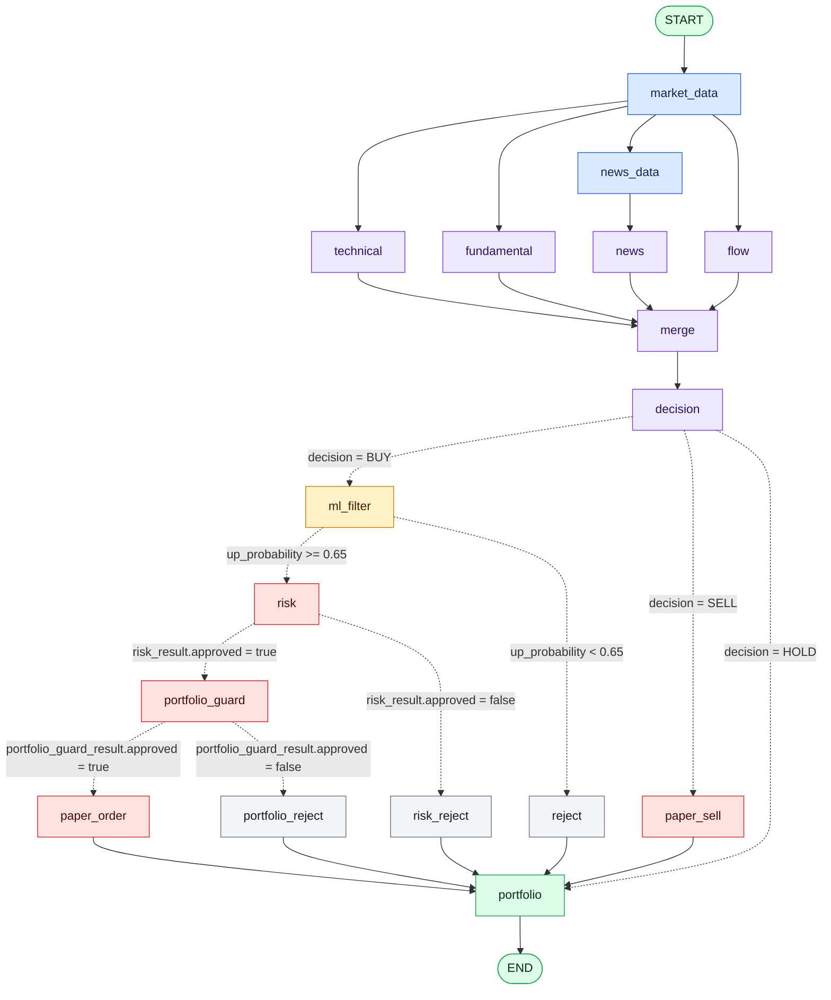
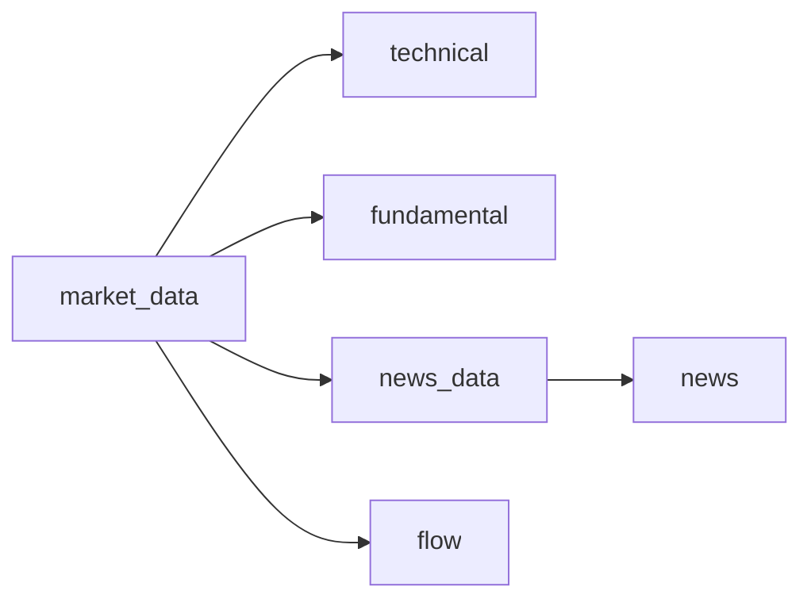
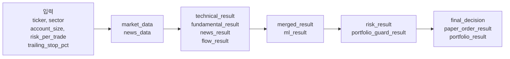

# LangGraph 실행 흐름 리포트

대상 구현: `multiagent_graph.py`  
실행 예제: `main.py`

이 문서는 현재 코드에 등록된 LangGraph 노드와 edge를 기준으로 작성했다. 실선은 일반 edge, 점선은 conditional edge를 의미한다.

## 전체 그래프



## 실행 단계

### 1. 시장 데이터 수집

`START → market_data`

`market_data_node`가 `state.ticker`의 최근 5년 OHLCV를 Yahoo Finance에서 가져와 `market_data`에 저장한다. 이후 네 분석 축으로 fan-out한다.

### 2. 병렬 분석 fan-out



| 노드 | 구현 및 외부 의존성 | 주요 처리 | 상태 출력 |
|---|---|---|---|
| `technical` | OpenAI agent + `technical_analysis_tool` | RSI, MACD, 이동평균, ATR, ADX, DI, 거래량을 평가 | `technical_result` |
| `fundamental` | OpenAI agent + KIS 기반 `fundamental_analysis_tool` | PER, PBR, ROE, 부채비율을 평가 | `fundamental_result` |
| `news_data` | `NewsAnalysisService` | 종목 뉴스와 실적 관련 원천 데이터를 수집 | `news_data` |
| `news` | OpenAI agent | 제공된 뉴스·실적 데이터만 사용해 심리, 촉매, 실적 위험을 평가 | `news_result` |
| `flow` | OpenAI agent + KIS `flow_analysis_tool` | 외국인·기관 누적 순매수, 동시 순매수와 지속성을 평가 | `flow_result` |

### 3. 분석 결과 fan-in

`technical`, `fundamental`, `news`, `flow` 네 노드가 모두 끝나야 `merge`가 실행된다.

```text
merged_result = {
    technical: technical_result,
    fundamental: fundamental_result,
    news: news_result,
    flow: flow_result
}
```

### 4. 구조화된 최종 판단과 Conditional Edge

`merge → decision`

네 전문 Agent와 Decision Agent의 출력은 Pydantic 모델로 검증되어 문자열이 아닌 구조화된 dict로 상태에 저장된다. 전문 Agent가 실패하거나 형식에 맞지 않는 결과를 내면 점수 50, NEUTRAL, LOW confidence의 명시적 오류 fallback을 사용한다. Decision 결과 검증 실패는 HOLD로 닫혀 주문을 차단한다.

Decision의 `decision` 필드가 BUY인 경우에만 ML 필터, Risk 및 Portfolio Guard를 실행한다. HOLD는 주문 없이 포트폴리오 평가로 이동하며, SELL은 실제 보유수량이 있을 때 별도 매도 노드로 이동한다.

### 5. BUY 실행 전 ML 필터

`decision(BUY) → ml_filter`

`ml_filter_node`는 학습된 앙상블 모델에서 해당 종목의 상승확률과 ML 점수를 조회한다.

| 조건 | route 값 | 다음 노드 |
|---|---|---|
| `up_probability >= 0.65` | `pass` | `risk` |
| `up_probability < 0.65` | `reject` | `reject` |

`reject`는 Decision Agent의 분석 판단은 보존하고, BUY 실행 결과만 `REJECTED`로 기록한 뒤 포트폴리오 평가로 이동한다.

### 6. 리스크 Conditional Edge

`risk_node`는 최신 가격과 ATR, 계좌규모 및 `RiskConfig`를 사용해 포지션 크기, 손절가와 목표가를 계산한다.

기본 리스크 설정:

| 설정 | 기본값 | 의미 |
|---|---:|---|
| `risk_per_trade` | 1% | 한 거래에서 허용하는 계좌 위험 비율 |
| `atr_stop_multiple` | 2.0 | 손절가격 계산에 사용하는 ATR 배수 |
| `reward_risk_ratio` | 1.5 | 목표 보상/위험 비율 |
| `max_position_pct` | 20% | 단일 포지션 최대 계좌 비중 |
| `max_portfolio_risk_pct` | 5% | 전체 포트폴리오 최대 위험 비율 |

| 조건 | route 값 | 다음 노드 |
|---|---|---|
| `risk_result.approved == True` | `approve` | `portfolio_guard` |
| `risk_result.approved == False` | `reject` | `risk_reject` |

`risk_reject`는 `HOLD - Risk rejected`를 설정한 뒤 `portfolio`로 이동한다.

### 6. 포트폴리오 가드 Conditional Edge

`portfolio_guard`는 기존 포지션과 신규 주문을 합친 예상 비중을 검사한다.

| 제한 | 기본값 | 판정 기준 |
|---|---:|---|
| 단일 종목 비중 | 20% | 기존 동일 종목과 신규 포지션의 합계 |
| 섹터 비중 | 30% | 기존 섹터 노출과 신규 포지션의 합계 |
| 총 투자 비중 | 80% | 기존 시장가치와 신규 포지션의 합계 |

| 조건 | route 값 | 다음 노드 |
|---|---|---|
| `portfolio_guard_result.approved == True` | `approve` | `decision` |
| `portfolio_guard_result.approved == False` | `reject` | `portfolio_reject` |

거절 시 사유를 포함한 `HOLD - Portfolio guard rejected: ...`를 생성한다.

### 7. 최종 의사결정 Conditional Edge

`decision` 노드는 기술적·기본적·뉴스·수급 분석 결과를 OpenAI decision agent에 전달하고 `BUY`, `HOLD`, `SELL` 중 하나와 이유를 받는다.

| 조건 | route 값 | 다음 노드 |
|---|---|---|
| `final_decision.strip().upper().startswith("BUY")` | `paper_buy` | `paper_order` |
| 그 외 | `no_trade` | `portfolio` |

현재 라우팅에서는 `SELL`도 신규 매도 주문으로 연결되지 않고 `no_trade`로 처리된다. 즉, 이 그래프의 주문 노드는 신규 `BUY` 실행에 초점이 맞춰져 있다.

### 8. 주문과 최종 포트폴리오 평가

`paper_order`는 선택된 브로커의 `buy()`를 호출한다.

- `BROKER_TYPE=paper`: 메모리 기반 모의 주문
- `BROKER_TYPE=kis`: KIS 주문 API
- `KIS_ENABLE_TRADING=false`: KIS 주문 차단

주문 결과는 `paper_order_result`에 기록되고 `logs/trades.csv`에 남는다. 성공·거절 여부와 관계없이 최종적으로 `portfolio`가 잔고, 시장가치, 손익, 종목 비중과 섹터 노출을 계산한 뒤 `END`로 종료한다.

## Conditional Edge 요약

| 출발 노드 | 라우터 | 분기 조건 | 목적지 |
|---|---|---|---|
| `ml_filter` | `route_after_ml` | 확률 ≥ 65% | `risk` |
| `ml_filter` | `route_after_ml` | 확률 < 65% | `reject` |
| `risk` | `route_after_risk` | 리스크 승인 | `portfolio_guard` |
| `risk` | `route_after_risk` | 리스크 거절 | `risk_reject` |
| `portfolio_guard` | `route_after_portfolio_guard` | 포트폴리오 승인 | `decision` |
| `portfolio_guard` | `route_after_portfolio_guard` | 포트폴리오 거절 | `portfolio_reject` |
| `decision` | `route_after_decision` | BUY로 시작 | `paper_order` |
| `decision` | `route_after_decision` | HOLD/SELL/기타 | `portfolio` |

## 상태(State) 흐름



| 상태 키 | 생산 노드 | 주요 소비 노드 |
|---|---|---|
| `ticker` | 초기 입력 | 거의 모든 분석 노드 |
| `sector` | 초기 입력 | `portfolio_guard`, 주문 메타데이터 |
| `account_size` | 초기 입력 | `risk` |
| `risk_per_trade` | 초기 입력 | `risk` |
| `trailing_stop_pct` | 초기 입력 | `paper_order` |
| `market_data` | `market_data` | `ml_filter`, `risk` |
| `news_data` | `news_data` | `news` |
| 네 분석 결과 | 각 분석 agent | `merge` |
| `merged_result` | `merge` | `decision` |
| `ml_result` | `ml_filter` | ML 라우터, `reject` |
| `risk_result` | `risk` | 리스크 라우터, `portfolio_guard`, `paper_order` |
| `portfolio_guard_result` | `portfolio_guard` | 가드 라우터, `portfolio_reject` |
| `final_decision` | `decision` 또는 reject 노드 | decision 라우터, `paper_order` |
| `paper_order_result` | `paper_order` | 최종 출력 |
| `portfolio_result` | `portfolio_guard`, `portfolio` | 가드 판정 및 최종 출력 |

## 실행 전 확인사항

현재 `StockState`와 노드 구현상 다음 초기값이 필요하다.

```python
initial_state = {
    "ticker": "005930.KS",
    "sector": "반도체",
    "account_size": 50_000_000,
    "risk_per_trade": 0.01,
    "trailing_stop_pct": 0.08,
    "market_data": None,
    "technical_result": None,
    "fundamental_result": None,
    "news_data": None,
    "news_result": None,
    "flow_result": None,
    "merged_result": None,
    "ml_result": None,
    "risk_result": None,
    "final_decision": None,
    "paper_order_result": None,
    "portfolio_result": None,
    "portfolio_guard_result": None,
}
```

현재 `main.py` 예제에는 `sector`, `risk_per_trade`, `trailing_stop_pct`, `news_data`, 주문·포트폴리오 관련 일부 초기 키가 빠져 있다. 실행 경로가 해당 키를 읽으면 `KeyError`가 발생할 수 있으므로 위 형태로 보완하는 것이 안전하다.

## 실행 명령

ML 모델과 `.env`를 준비한 뒤 실행한다.

```powershell
uv run python main.py
```

실거래를 의도하지 않는 경우:

```dotenv
BROKER_TYPE=paper
KIS_ENABLE_TRADING=false
```

## 구현상 주의점 및 개선 후보

1. **초기 State 불일치**  
   `main.py`의 초기 상태와 `StockState`/노드가 요구하는 키가 일치하지 않는다. 위 초기값으로 정렬할 필요가 있다.

2. **결정 agent 호출 위치**  
   ML, 리스크, 포트폴리오 가드를 모두 통과한 뒤에만 `decision`이 실행된다. 따라서 분석 결과가 있어도 앞선 정량 필터에서 탈락하면 decision agent 판단은 수행하지 않는다.

3. **SELL 실행 경로 부재**  
   `SELL`은 현재 `no_trade → portfolio`로 라우팅된다. 보유 포지션 청산까지 원한다면 별도 `sell_order` 노드와 conditional edge가 필요하다.

4. **ML 통과 기준 이중성**  
   `ml.ml_filter.predict_up_probability()`는 `ml_rank <= 10`을 `ml_pass`로 반환하지만 실제 그래프 라우터는 이를 사용하지 않고 `up_probability >= 0.65`만 사용한다.

5. **에이전트 출력 파싱**  
   기술·기본·뉴스·수급 및 최종 결정은 대부분 텍스트로 상태에 저장된다. 구조화 출력 스키마를 사용하면 라우팅과 감사 가능성이 높아진다.

6. **실거래 안전장치**  
   KIS 브로커 사용 시에도 `KIS_ENABLE_TRADING=false`를 기본으로 유지하고, 주문 전 별도 승인 노드나 idempotency key를 추가하는 것이 안전하다.

## 관련 파일

- 그래프와 모든 노드: `multiagent_graph.py`
- 실행 상태 예제: `main.py`
- ML 예측 어댑터: `ml/ml_filter.py`
- ML 앙상블 학습: `ml/train_model.py`
- 리스크 계산: `risk/risk_engine.py`, `risk/risk_config.py`
- 포트폴리오 제한: `portfolio_manager.py`
- 브로커 선택: `broker/trading_context.py`
- 주문 구현: `broker/paper.py`, `broker/kis.py`
- 포지션 관리: `paper/position_manager.py`
