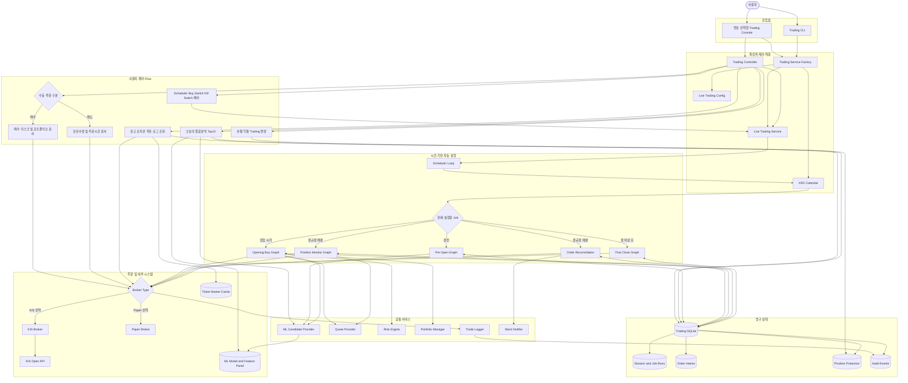
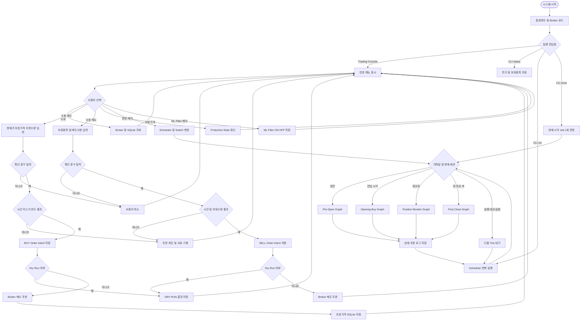
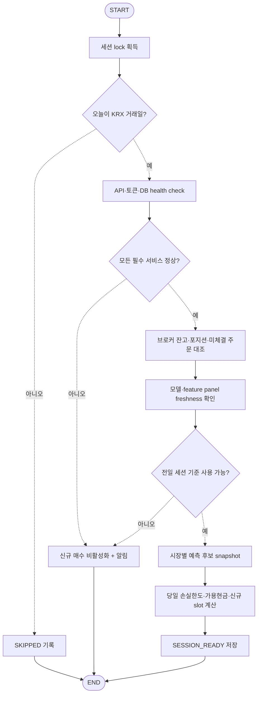
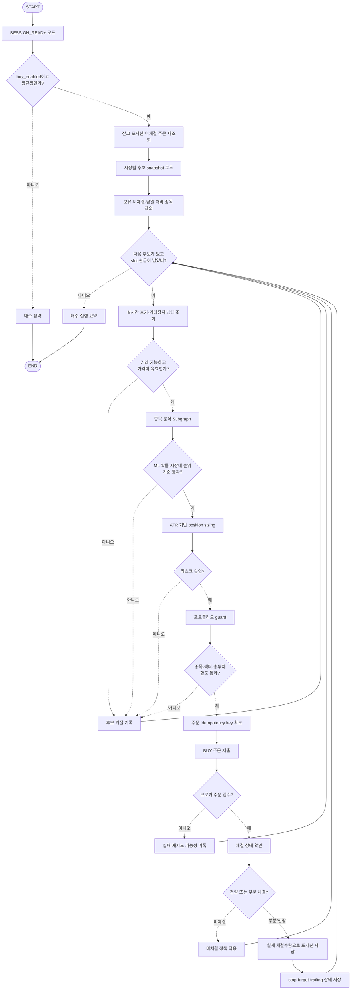
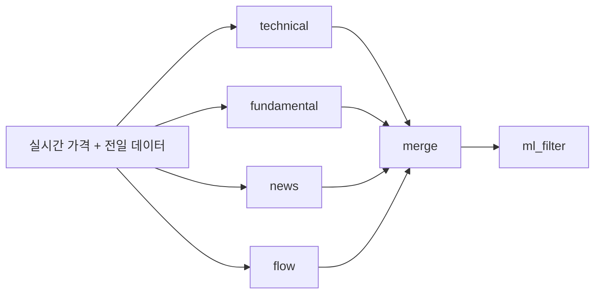
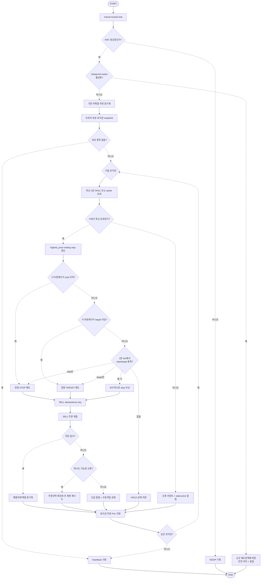
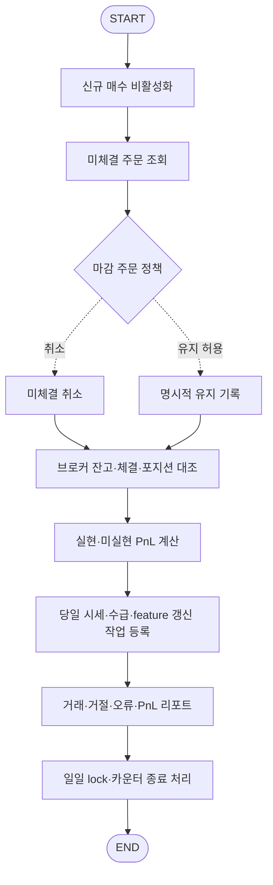

# 일일 신규 매수 및 1분 포지션 감시 시스템 제안

> 구현 상태: `trading/` 패키지에 scheduler, 4개 유한 LangGraph, SQLite 상태·멱등성 저장소, PaperBroker 통합 테스트를 구현했다. 현재가 기반 분봉 대체와 미체결 주문 reconciliation은 실계좌 적용 전에 교체·보강해야 한다. 실행법은 README의 "일일 자동매매 서비스"를 참고한다.

## 1. 목표

이 시스템은 두 개의 독립적인 실행 축을 하나의 거래 운영 서비스로 묶는다.

1. **개장 신규 매수 축**: 매 거래일 장 시작 시 후보 종목을 분석하고 리스크·포트폴리오 제한을 통과한 종목만 신규 매수한다.
2. **장중 포지션 감시 축**: 정규장 동안 1분마다 보유 포지션을 조회하고 손절, 익절 및 trailing stop 조건을 감시해 자동 매도한다.

두 축은 브로커 포지션, 주문 상태, 리스크 한도와 거래 로그를 공유한다. 개장 매수 그래프와 1분 감시 그래프는 한 번 호출될 때 반드시 종료되는 유한 작업으로 설계하고, 반복 실행은 LangGraph 바깥의 스케줄러가 담당한다.

> KRX 정규시장 거래시간은 통상 Asia/Seoul 기준 09:00~15:30이다. 휴일, 연말 휴장, 임시휴장 및 개장시간 변경일은 단순 평일 계산이 아니라 거래소 캘린더로 판정해야 한다. [KRX Trading Hours and Holidays](https://global.krx.co.kr/contents/GLB/06/0602/0602010201/GLB0602010201T1.jsp)

## 2. 권장 운영 타임라인

| 시각(Asia/Seoul) | 작업 | 설명 |
|---|---|---|
| 08:40~08:55 | `pre_open_prepare` | 거래일 확인, API·토큰·잔고·기존 주문 동기화, 전일 데이터와 모델 freshness 확인 |
| 08:55 | `candidate_snapshot` | 전일 종가 기준 후보와 모델 점수를 고정하고 당일 실행 ID 생성 |
| 09:00~09:05 | `opening_buy_graph` | 개장 호가 안정화 정책에 따라 신규 분석·매수 실행 |
| 09:00~15:30 | `position_monitor_graph` | 1분마다 보유 종목 시세와 주문 상태를 감시 |
| 15:30 이후 | `post_close_reconcile` | 미체결 주문 처리, 브로커 잔고 대조, 일일 손익·거래·오류 보고 |

09:00 정확히 시장가 주문을 내면 시가 단일가 직후 변동성과 슬리피지가 클 수 있다. 운영 설정으로 `ENTRY_DELAY_MINUTES=0~5`를 두고 기본값을 5분으로 시작한 뒤 검증 결과에 따라 조정하는 방식을 권장한다.

## 3. 전체 시스템 Flow

### 3.1 최상위 제어 및 구성요소

사용자는 번호 선택형 콘솔 또는 단일 명령 CLI를 통해 시스템에 진입한다. `TradingController`는 사용자 조회·수동 주문·보호가격 변경·운영 제어를 담당하고, `LiveTradingService`는 시간에 따라 네 개의 유한 LangGraph를 실행한다.



### 3.2 조건 분기 중심 실행 Flow

다음 다이어그램은 사용자 요청과 자동 Scheduler 요청이 `TradingController` 및 `LiveTradingService`를 거쳐 조회·주문·LangGraph 실행으로 분기되는 과정을 나타낸다.



## 4. 스케줄러 설계

스케줄러는 LangGraph 외부에서 다음 유한 그래프를 호출한다.

| Job | 실행 주기 | 중복 실행 정책 |
|---|---|---|
| `pre_open_prepare` | 거래일 08:40 1회 | `trade_date` 기준 1회 |
| `opening_buy_graph` | 거래일 설정된 진입 시각 1회 | `trade_date + strategy_version` 기준 1회 |
| `position_monitor_graph` | 정규장 중 매분 | `trade_date + minute_bucket` 기준 1회 |
| `post_close_reconcile` | 장 마감 후 1회 | `trade_date` 기준 1회 |

권장 구현 후보는 APScheduler, Celery Beat, 운영체제 스케줄러 또는 별도 asyncio 서비스다. 중요한 것은 스케줄러가 죽었다가 재시작되어도 persistent store에서 마지막 성공 시각을 읽고 안전하게 복구하는 것이다.

1분 monitor를 다음과 같은 LangGraph 내부 무한 루프로 구현하지 않는다.

```text
monitor → sleep(60초) → monitor → ...
```

이 구조는 배포, 취소, 장애 복구, timeout 및 중복 실행 제어가 어렵다. 대신 매분 독립적인 짧은 그래프 실행으로 만든다.

## 5. Pre-open 준비 그래프



### Pre-open 산출물

```text
session_id
trade_date
market_open_at / market_close_at
strategy_version / model_version
feature_as_of
candidate_snapshot
starting_cash / starting_equity
available_new_position_slots
daily_loss_limit
buy_enabled
health_check_result
```

모델은 당일 아직 확정되지 않은 종가나 수급을 사용하지 않는다. 개장 매수 후보는 원칙적으로 직전 완료 거래일의 feature panel과 모델로 고정한다.

## 6. 신규 종목 매수 LangGraph

기존 `multiagent_graph.py`의 분석 축을 재사용하되, 여러 후보를 순차 또는 제한된 병렬도로 평가하는 상위 coordinator를 둔다.



### 종목 분석 Subgraph



### 매수 Conditional Edge

| 출발 노드 | 조건 | 통과 경로 | 거절 경로 |
|---|---|---|---|
| `session_guard` | 거래일·정규장·buy enabled | 후보 로드 | 매수 생략 |
| `tradeability_guard` | 거래정지 아님, 유효 호가, 가격제한·이상 스프레드 정책 통과 | 분석 | 후보 거절 |
| `ml_guard` | 확률과 시장 내 순위 기준 통과 | 리스크 | 후보 거절 |
| `risk_guard` | 수량 > 0, 손절가 유효, 일일 위험예산 이내 | 포트폴리오 검사 | 후보 거절 |
| `portfolio_guard` | 단일 종목·섹터·총 투자비중 이내 | 주문 | 후보 거절 |
| `order_ack_guard` | 주문번호 수신 | 체결 확인 | 오류 정책 |

### 주문 정책 제안

- 진입 주문은 초기 운영에서 시장가보다 가격 제한이 있는 주문을 우선 고려한다.
- 주문 전후 브로커 잔고를 다시 조회한다.
- 주문 키는 `trade_date + strategy + ticker + side`로 만들어 중복 매수를 방지한다.
- 부분 체결은 실제 체결수량을 기준으로 stop/target을 생성한다.
- 일정 시간 미체결 주문은 취소하거나 가격을 한정적으로 재산정한다.
- API timeout을 주문 실패로 단정하지 말고 주문내역을 먼저 조회한다.

## 7. 1분 포지션 감시 LangGraph

스케줄러가 정규장 중 매분 한 번씩 호출한다. 한 번의 invocation은 모든 보유 종목을 snapshot으로 읽고 평가한 후 종료한다.



### 1분 감시 판정 순서

기존 `paper/position_manager.py`의 보수적인 체결 가정을 유지하면서 분봉용 메서드를 분리하는 것을 권장한다.

```text
effective_stop = max(fixed_stop, trailing_stop)

1. gap/open <= effective_stop  → 실제 가능한 현재가/호가로 STOP 매도
2. gap/open >= take_profit     → 실제 가능한 현재가/호가로 TARGET 매도
3. low <= stop 및 high >= target → 순서를 알 수 없으므로 stop 우선
4. low <= stop                 → STOP 매도
5. high >= target              → TARGET 매도
6. 그 외                       → highest와 trailing stop 갱신 후 HOLD
```

실거래에서는 bar의 stop 가격에 정확히 체결됐다고 가정하면 안 된다. `PositionManager`는 “매도 사유와 트리거 가격”을 결정하고, 실제 체결가격과 수량은 브로커 체결 조회 결과로 확정해야 한다.

## 8. 마감 정산 그래프



## 9. 권장 State 모델

### 공통 세션 State

```python
class TradingSessionState(TypedDict):
    session_id: str
    trade_date: str
    timezone: str
    market_phase: str
    market_open_at: str
    market_close_at: str
    strategy_version: str
    model_version: int
    feature_as_of: str
    buy_enabled: bool
    kill_switch: bool
    starting_equity: float
    daily_realized_pnl: float
    daily_loss_limit: float
    error_count: int
```

### 매수 그래프 State

```python
class OpeningBuyState(TradingSessionState):
    candidates: list[dict]
    current_candidate: dict | None
    quote: dict | None
    analysis_result: dict | None
    ml_result: dict | None
    risk_result: dict | None
    portfolio_result: dict | None
    order_intent: dict | None
    order_result: dict | None
    accepted_orders: list[dict]
    rejected_candidates: list[dict]
```

### 감시 그래프 State

```python
class PositionMonitorState(TradingSessionState):
    minute_bucket: str
    positions: list[dict]
    current_position: dict | None
    minute_bar: dict | None
    effective_stop: float | None
    exit_reason: str | None
    sell_intent: dict | None
    order_result: dict | None
    monitor_results: list[dict]
```

## 10. 상태 저장소와 데이터 모델

메모리 객체만 사용하면 프로세스 재시작 시 trailing stop과 주문 상태가 사라진다. 최소한 SQLite, 운영 환경에서는 PostgreSQL 같은 영속 저장소를 권장한다.

| 테이블/컬렉션 | 핵심 키 | 저장 내용 |
|---|---|---|
| `trading_sessions` | `trade_date`, `strategy_version` | 세션 상태, 모델 버전, 시작 자산, kill switch |
| `candidate_snapshots` | `session_id`, `ticker` | 후보 점수, 시장 내 순위, 데이터 기준시각 |
| `order_intents` | `idempotency_key` | 주문 전 의사결정, 수량, 제한가격, stop/target |
| `broker_orders` | `broker_order_id` | 접수·부분체결·전량체결·취소·거절 상태 |
| `positions` | `account`, `ticker` | 실제 수량, 평균가, stop, target, highest, trailing stop |
| `minute_monitor_runs` | `trade_date`, `minute_bucket` | 1분 실행 heartbeat, 처리 종목, 오류 |
| `risk_snapshots` | `session_id`, `ticker` | 주문 당시 리스크·포트폴리오 한도 판정 |
| `audit_events` | event UUID | 모든 상태 전이와 운영자 조치 |

브로커의 실제 잔고와 주문내역을 source of truth로 삼고 로컬 DB는 제어·감사 상태로 사용한다. 불일치가 발견되면 신규 매수를 막고 reconcile을 먼저 수행한다.

## 11. 안전장치

### 필수 제어

- `KIS_ENABLE_TRADING=false`를 기본값으로 유지하고 paper 환경에서 충분히 검증한다.
- 일일 최대 손실, 일일 최대 주문 수, 종목당 최대 재시도 횟수를 둔다.
- 동일 종목·방향 중복 주문을 idempotency key로 차단한다.
- 미체결 매도 주문이 있으면 같은 포지션에 추가 매도를 내지 않는다.
- 시세가 일정 시간 이상 stale이면 자동 주문 대신 알림과 안전 상태로 전환한다.
- API 연속 오류, DB 오류, 잔고 불일치 시 신규 매수를 차단하는 circuit breaker를 둔다.
- 수동 `kill_switch`와 `buy_only_disabled`를 별도로 둔다.
- 주문 timeout 뒤에는 재주문 전에 반드시 주문내역을 조회한다.
- 거래정지, 관리종목, 가격제한, VI 및 비정상 스프레드 처리 정책을 둔다.

### Kill switch 수준

| 상태 | 신규 매수 | 보호성 매도 | 용도 |
|---|---|---|---|
| `NORMAL` | 허용 | 허용 | 정상 운영 |
| `BUY_DISABLED` | 차단 | 허용 | 데이터·모델·한도 문제 |
| `DEGRADED` | 차단 | 가능하면 허용 | 일부 API 장애 또는 stale quote |
| `HALTED` | 차단 | 운영자 정책 | 심각한 불일치·중복 주문 위험 |

보호성 매도까지 일괄 차단하면 위험이 커질 수 있으므로 신규 매수 차단과 전체 주문 차단을 분리한다.

## 12. 기존 코드에서 필요한 주요 변경

| 영역 | 현재 상태 | 제안 변경 |
|---|---|---|
| 스케줄링 | 없음 | 거래 캘린더 기반 scheduler 서비스 추가 |
| 그래프 | 단일 종목 분석·BUY 중심 | pre-open, opening-buy coordinator, minute-monitor, EOD 그래프로 분리 |
| 시세 | `get_current_price`, 일봉 다운로드 | 여러 보유종목 batch quote 및 1분 OHLC provider 추가 |
| PositionManager | `process_daily_bar()` | `process_minute_bar()`와 trigger/order execution 분리 |
| 주문 상태 | 단일 `OrderResult` | 주문 intent, broker order, fill 상태 머신 추가 |
| 포지션 상태 | Paper는 메모리, KIS 메타데이터도 메모리 | stop/target/highest/trailing 영속화 |
| SELL 라우팅 | 분석 그래프의 SELL은 no-trade | 장중 감시 전용 sell order subgraph 추가 |
| 로그 | CSV 거래 로그 | 구조화 audit log + DB + 알림 추가 |
| 장애 복구 | 프로세스 메모리 의존 | 시작 시 broker reconcile 및 idempotent resume |
| API 호출 | 종목별 호출 중심 | KIS rate limit을 고려한 batch/queue/throttle |

## 13. 권장 모듈 구조

```text
trading/
├─ scheduler.py                  # 거래일·세션별 job 실행
├─ calendar.py                   # KRX 캘린더와 특별 개장일
├─ service.py                    # 프로세스 lifecycle, health, shutdown
├─ state_store.py                # DB 트랜잭션과 checkpoint
├─ idempotency.py                # minute/job/order 중복 방지
├─ alerts.py                     # 오류·주문·PnL 알림
├─ graphs/
│  ├─ pre_open_graph.py
│  ├─ opening_buy_graph.py
│  ├─ analysis_subgraph.py
│  ├─ position_monitor_graph.py
│  └─ post_close_graph.py
├─ nodes/
│  ├─ session_nodes.py
│  ├─ candidate_nodes.py
│  ├─ risk_nodes.py
│  ├─ order_nodes.py
│  ├─ monitor_nodes.py
│  └─ reconcile_nodes.py
├─ market_data/
│  ├─ quote_provider.py
│  └─ minute_bar_provider.py
└─ models/
   ├─ session.py
   ├─ order.py
   └─ monitor.py
```

## 14. 구현 단계 제안

### Phase 1: Paper dry-run

- 거래 캘린더와 scheduler
- opening-buy graph와 minute-monitor graph
- SQLite state store
- 1분 가상 시세 replay
- 주문 없이 `DRY_RUN` intent와 trigger만 기록

### Phase 2: Paper execution

- PaperBroker의 1분 시세 업데이트
- stop/target/trailing 매도 체결
- 프로세스 재시작·중복 실행·부분 실패 테스트
- 일일 리포트와 알림

### Phase 3: KIS 모의투자

- KIS 주문·체결·미체결 조회 상태 머신
- rate limit, timeout, 재조회 및 취소 정책
- 실제 장중 1분 shadow monitoring
- paper 판단과 KIS 결과 대조

### Phase 4: 제한된 실전 운영

- 소액·소수 종목·낮은 일일 주문 한도
- 수동 승인 또는 단계적 자동승인
- kill switch 훈련과 장애 대응 runbook
- 충분한 운영 로그 검증 후 점진 확대

## 15. 테스트 시나리오

| 시나리오 | 기대 결과 |
|---|---|
| 휴장일 또는 특별 개장시간 | 매수·감시 job이 올바른 세션시간을 사용 |
| 스케줄러가 같은 분을 두 번 호출 | 두 번째 invocation은 idempotent skip |
| 개장 전 데이터가 stale | 신규 매수 차단, 기존 포지션 감시는 유지 |
| stop과 target이 같은 1분봉에서 모두 충족 | 보수적으로 stop 우선 |
| gap-down으로 stop 아래에서 시작 | stop 값이 아닌 실제 가능한 가격 정책으로 매도 |
| 주문 timeout 후 실제로는 접수됨 | 주문내역 재조회로 중복 주문 방지 |
| 부분 체결 | 체결수량만 포지션·현금·보호가격에 반영 |
| 프로세스가 장중 재시작 | broker reconcile 후 마지막 minute 다음부터 재개 |
| 시세 API 연속 실패 | circuit breaker, 신규 매수 차단, 경고 발생 |
| 일일 손실한도 초과 | 신규 매수 차단 및 정의된 청산 정책 적용 |
| DB와 브로커 포지션 불일치 | 자동 매수 중단 후 reconcile 상태로 전환 |

## 16. 핵심 설계 결정 요약

1. 장기 실행과 시간 제어는 scheduler가 담당한다.
2. LangGraph는 한 번 호출될 때 종료되는 결정 workflow로 사용한다.
3. 개장 매수와 1분 포지션 감시는 별도의 그래프로 분리한다.
4. 브로커 주문·체결 내역이 실제 포지션의 source of truth다.
5. stop, target, highest, trailing stop과 주문 intent를 영속화한다.
6. 중복 주문 방지와 재시작 복구를 첫 구현 단계부터 포함한다.
7. 신규 매수 차단과 보호성 매도 차단을 서로 다른 kill switch로 관리한다.
8. 실거래 전에 dry-run → paper → KIS virtual → 제한된 real 순으로 검증한다.

## 17. 관련 기존 구현

- 종목 분석 및 매수 그래프: `multiagent_graph.py`
- 포트폴리오 한도: `portfolio_manager.py`
- ATR 포지션 크기: `risk/risk_engine.py`
- 일봉 손절·익절·trailing: `paper/position_manager.py`
- 브로커 인터페이스: `broker/base.py`
- Paper 브로커: `broker/paper.py`
- KIS 브로커: `broker/kis.py`
- 거래 로그: `paper/trade_logger.py`

이 문서는 운영 아키텍처 제안이며 자동매매의 수익성이나 안정성을 보장하지 않는다. 실전 적용 전에는 주문·체결·장애·재시작·휴장일·특별 개장시간을 포함한 충분한 paper 및 모의투자 검증이 필요하다.
