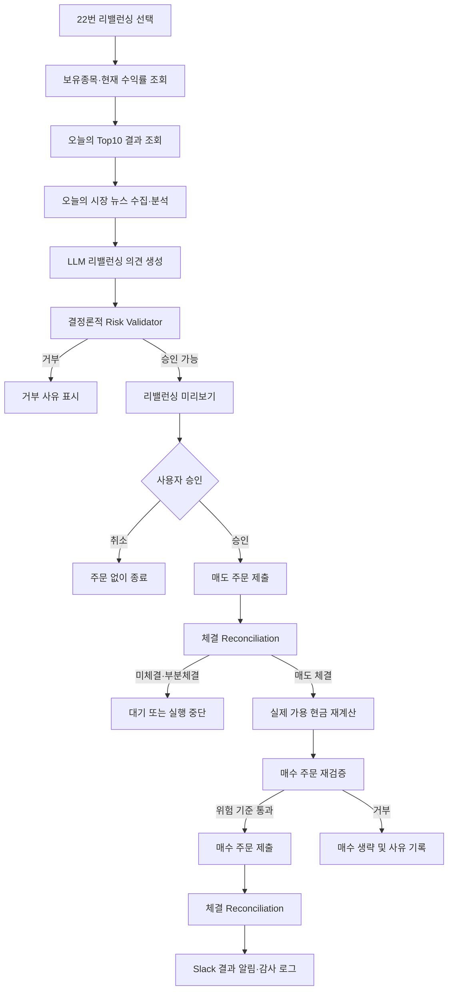

Rebalancing 제안


현재 메뉴 구성에서는 보유종목 조회가 2번이므로, 신규 22번을 “LLM 포트폴리오 리밸런싱” 메뉴로 추가하는 구성이 적합합니다.
제안 메뉴


[AI 포트폴리오]
20. 오늘의 종합분석 Top10 추천
22. LLM 포트폴리오 리밸런싱 제안·실행
22번의 실행 흐름은 다음과 같이 구성합니다.




## 1. LLM 입력 데이터
LLM에는 원본 API 응답 전체가 아니라 정규화한 다음 정보만 전달합니다.
보유종목:
```
{
  "ticker": "005930.KS",
  "name": "삼성전자",
  "quantity": 10,
  "avg_price": 70000,
  "current_price": 75000,
  "market_value": 750000,
  "return_pct": 7.14,
  "portfolio_weight_pct": 15.2,
  "stop_loss": 68000,
  "take_profit": 84000,
  "trailing_stop_pct": 8.0
}
```
Top10 추천:
```
{
  "ticker": "000660.KS",
  "rank": 1,
  "total_score": 82.4,
  "technical_score": 85.0,
  "fundamental_score": 78.0,
  "news_score": 80.0,
  "flow_score": 86.0,
  "recommendation_reason": "..."
}
```
시장 뉴스 분석:
- KOSPI·KOSDAQ 시장 방향
- 외국인·기관 수급
- 금리·환율·유가
- 반도체·바이오 등 섹터 이슈
- 주요 국내외 지수 흐름
- 지정학·정책 위험
- 뉴스 제목과 출처 시각
- 긍정·중립·부정 점수
- 시장 위험 수준

## 2. LLM 출력 형식
LLM 자유 텍스트를 바로 주문에 사용하면 안 됩니다. Pydantic 구조화 출력으로 제한해야 합니다.
```
class RebalanceAction(BaseModel):
    ticker: str
    action: Literal["BUY", "SELL", "HOLD", "REDUCE"]
    target_weight_pct: float
    confidence: float
    reason: str
    supporting_factors: list[str]
    risks: list[str]


class RebalanceProposal(BaseModel):
    market_view: Literal[
        "RISK_ON",
        "NEUTRAL",
        "RISK_OFF",
    ]
    market_summary: str
    recommended_cash_pct: float
    actions: list[RebalanceAction]
    overall_reason: str
```

LLM은 다음 사항만 제안합니다.
- 유지할 종목
- 비중을 줄일 종목
- 전량 매도할 종목
- 신규 편입 후보
- 목표 비중
- 현금 보유 비율
- 판단 근거와 위험 요인
주문 수량과 최종 주문 가능 여부는 코드가 계산해야 합니다.

## 3. Risk Validator
LLM 제안 이후 별도 검증 계층이 필요합니다.
검증 항목:
- Kill Switch 상태
- 신규 매수 활성화 여부
- 정규장 여부
- 일일 주문 한도
- 종목당 최대 비중
- 섹터 최대 비중
- 최소 현금 비중
- 일일 손실 제한
- 최대 포트폴리오 회전율
- Top10 이외 신규 종목 매수 금지
- 현재 미체결 주문과 중복 여부
- 현재가 데이터 최신성
- 최소 주문금액
- 매도 가능 수량
- 매도 체결 전 예상 현금을 매수 자금으로 사용하지 않기
추천 기본 제한값은 다음과 같습니다.

- TRADING_REBALANCE_ENABLED=false
- TRADING_REBALANCE_MAX_TURNOVER_PCT=30
- TRADING_REBALANCE_MAX_POSITION_PCT=20
- TRADING_REBALANCE_MAX_SECTOR_PCT=40
- TRADING_REBALANCE_MIN_CASH_PCT=10
- TRADING_REBALANCE_MIN_CONFIDENCE=0.70
- TRADING_REBALANCE_REQUIRE_TOP10_FOR_NEW_BUY=true
- TRADING_REBALANCE_REQUIRE_SELL_FILL_BEFORE_BUY=true


## 4. 콘솔 미리보기
22번을 선택하면 먼저 다음 표를 보여주는 방식이 적합합니다.
[오늘의 시장 판단]
```
시장 상태 : NEUTRAL
권장 현금 : 15%
주요 근거 : 외국인 순매수 회복, 원/달러 환율 상승 위험
```


[리밸런싱 제안]
```
종목       현재비중  목표비중  주문       예상수량  신뢰도  제안 근거
삼성전자     20.0%    15.0%   REDUCE       3주     82%   단기 과매수
SK하이닉스    0.0%    10.0%   BUY          2주     88%   Top10 1위
현대차        8.0%     8.0%   HOLD          -      75%   추세 유지
```

[예상 포트폴리오]
```
현재 평가금액       10,000,000원
예상 매도금액        1,200,000원
예상 매수금액          950,000원
리밸런싱 후 현금비중        15.3%
예상 회전율                 21.5%
```

실계좌에서는 다음과 같은 강한 확인 문구를 적용하는 것이 안전합니다.
- 제안서 ID: RB-20260901-A31F
- 실제 주문을 실행하려면 다음을 입력하세요:
- REBALANCE RB-20260901-A31F

## 5. 주문 실행 순서
동시에 매수·매도를 실행하면 예상 현금과 실제 현금이 달라질 수 있으므로 순차 실행이 필요합니다.
- 1. 매도 주문 제출
- 2. KIS reconciliation 실행
- 3. 매도 체결 수량과 실제 매도가 확인
- 4. 실제 예수금 재조회
- 5. 매수 수량 재계산
- 6. 포트폴리오 제한 재검사
- 7. 매수 주문 제출
- 8. 최종 reconciliation
- 9. Slack 결과 전송
부분체결이 발생하면 매수 주문은 실제 매도 체결금액 범위에서만 실행하거나 안전하게 중단해야 합니다.


## 6. 권장 파일 구조
```
trading/
├── rebalance_models.py       # Pydantic 입출력 모델
├── rebalance_snapshot.py     # 보유종목·Top10·뉴스 입력 생성
├── market_news.py            # 오늘의 시장 전체 뉴스 수집
├── rebalance_advisor.py      # LLM 호출 및 구조화 출력
├── rebalance_validator.py    # 비중·현금·회전율·위험 검증
├── rebalance_executor.py     # 승인된 매도→체결→매수 실행
├── rebalance_graph.py        # LangGraph 리밸런싱 흐름
├── controller.py             # preview/approve/execute 연결
└── console.py                # 22번 메뉴 UI
```


## 7. Slack 알림
제안 생성 시:
🤖 리밸런싱 제안 생성
```
제안서: RB-20260901-A31F
시장 판단: NEUTRAL
매도 제안: 2종목
매수 제안: 1종목
권장 현금비중: 15%
상태: 사용자 승인 대기
```

실행 완료 시:
✅ 리밸런싱 실행 완료

```
삼성전자 매도 3주 / 실제 매도가 75,100원
SK하이닉스 매수 2주 / 실제 매수가 184,500원
최종 현금비중 15.4%
매도 1건·매수 1건 체결
```


## Risk Validator Override 기능 구현

이제 현금비중이나 회전율 때문에 거부되면 다음 선택지가 표시됩니다.
[Risk Validator 거부 사유]
- 예상 현금 비중이 요구 비중 35.0%보다 낮습니다.

경고: 이 제안은 투자정책 한도를 위반합니다.

Override하려면 다음 문구 입력:

OVERRIDE RB-20260901-XXXXXXXX
정확히 입력하면 주문을 실행합니다.

Override 가능한 항목:
- LLM 권장 현금비중 미달
- 시스템 최소 현금비중 미달
- 최대 회전율 초과

Override할 수 없는 항목:
- Top10 외 신규매수
- 현재가 누락
- 중복 종목 제안
- 종목 최대비중 초과
- 섹터 최대비중 초과
- 총평가금액 오류

Override 실행 시 다음 기록이 남습니다.
- REBALANCE_RISK_OVERRIDE 감사 로그
- 원래 Risk Validator 거부 사유
- 사용자 승인 시각
- Slack 경고 알림
- 최종 실행 알림의 Risk Override: YES