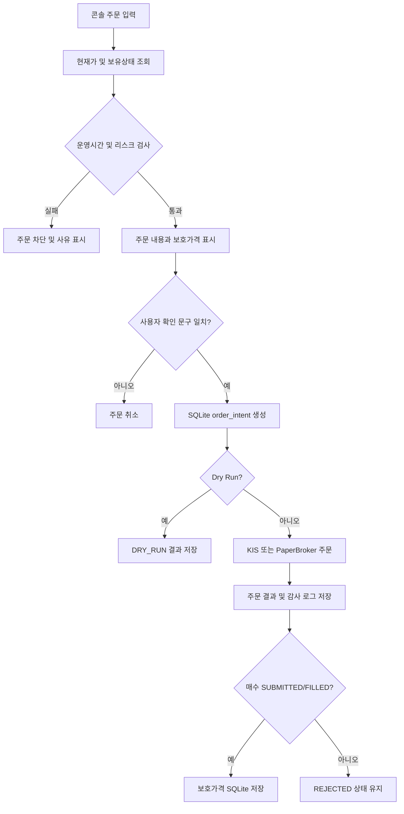

# KRX 자동매매 제어 콘솔

## 1. 개요

`trading.console`은 KIS 또는 PaperBroker 기반 자동매매 시스템을 번호 선택 방식으로 제어하는 터미널 UI다. 잔고와 보유종목 조회, 수동 매수·매도, 보호가격 관리, 자동매매 Scheduler 제어 및 감사 로그 조회 기능을 제공한다.

콘솔은 다음 구성요소를 사용한다.

| 구성요소 | 파일 | 역할 |
|---|---|---|
| 터미널 UI | `trading/console.py` | 메뉴 출력, 사용자 입력 및 주문 최종 확인 |
| 제어 계층 | `trading/controller.py` | 주문 검증, Broker 호출, Scheduler 제어 |
| 표 출력 | `trading/display.py` | 한글과 숫자를 고려한 터미널 표 정렬 |
| 실행 서비스 | `trading/service.py` | 장전·개장 매수·장중 감시·장후 LangGraph 실행 |
| 상태 저장소 | `trading/state_store.py` | 세션, 주문 의도, 보호가격, 감사 로그 저장 |
| Broker | `broker/kis.py`, `broker/paper.py` | KIS 또는 PaperBroker 주문·잔고 인터페이스 |

## 2. 실행 방법

프로젝트 루트에서 다음 명령을 실행한다.

권장 브라우저 인터페이스:

```powershell
uv run streamlit run trading/web_app.py
```

브라우저에서 `http://localhost:8501`로 접속한다. 기존 번호형 터미널 UI도 계속 사용할
수 있지만 동일 계좌에 대해 두 Scheduler를 동시에 실행하면 안 된다.

```powershell
uv run python -m trading.console
```

기존 터미널에서 아래 Scheduler를 이미 실행하고 있다면 중지한 후 콘솔 내부 Scheduler를 사용한다.

```powershell
uv run python -m trading.cli run
```

두 Scheduler를 동시에 실행해도 SQLite job key가 동일 작업의 중복 실행을 차단하지만, 운영 상태를 혼동할 수 있으므로 하나만 실행하는 것을 권장한다.

## 3. 화면 상단 상태

콘솔 상단에는 항상 다음 상태가 표시된다.

| 항목 | 설명 |
|---|---|
| `Broker` | `KISBroker` 또는 `PaperBroker` |
| `Account` | `VIRTUAL`, `REAL` 또는 `PAPER` |
| `Trading` | KIS 주문 전송 허용 여부 |
| `Dry Run` | `True`이면 Broker에 주문을 전송하지 않음 |
| `Market` | `PRE_OPEN`, `REGULAR`, `POST_CLOSE`, `CLOSED_DAY` |
| `Scheduler` | 현재 콘솔 내부 Scheduler 실행 상태 |
| `Buy` | 항상 `ON` |
| `Kill Switch` | `NORMAL` 또는 `HALTED` |

`REAL` 계좌이면서 `Dry Run=False`인 경우 실제 자금 주문 모드 경고가 추가로 표시된다.

## 4. 전체 메뉴

```text
[주문]
 1. Buy/Sell 예약종목 조회 및 취소/정정
 2. 사용자 지정 종목명 매수
 3. 사용자 지정 종목 매도    4. 미체결 주문 조회 및 취소
 5. 최근주문체결내역

[자동매매]
 6. 매도전략 선택(샹들리에|돈치안|직접지정)
 7. 자동매매 작업 수동 실행

[포트폴리오 관리]
 8. API reconciliation
 9. 잔고 및 보유종목 조회    10. 오늘의 Top10 추천 및 결과저장
 11. 보유 및 Top10추천종목 리밸런싱 제안 및 승인 후 주문예약

[설정관리]
 12. 시스템 실행 상태
 13. Scheduler 시작·중지 Toggle
 14. 감사 로그
 15. 전체 Kill Switch         16. ML Filter ON/OFF
 17. Slack 알림 연결 테스트

0. 종료
```

### 7.7 LLM 포트폴리오 리밸런싱

11번 메뉴는 현재 보유종목의 평균단가·현재가·손익률·비중, 10번 메뉴에서 마지막으로
완료한 당일 Top10, 그리고 국내외 시장뉴스를 LLM에 구조화된 입력으로 전달한다.
10번에서 선택한 `KOSPI`, `KOSDAQ`, `Both` 범위와 추천 결과를 그대로 사용하며,
11번 실행 중에는 다른 시장의 Top10 분석을 자동으로 실행하지 않는다. 당일 10번
결과가 없으면 리밸런싱을 중단하고 10번을 먼저 실행하도록 안내한다. LLM은
`BUY`, `SELL`, `REDUCE`, `HOLD`와 목표 비중을 제안할 뿐 주문을 직접 실행하지 않는다.

제안 주문은 일괄 승인하지 않는다. 종목별로 제안 구분·수량·가격·근거를 확인하고
`A` 승인, `M` BUY/SELL 및 수량 수정, `X` 제외, `Q` 전체 취소 중 하나를 반드시
선택한다. 수정·승인된 주문 묶음은 Risk Validator가 종목·섹터 비중, 보유수량,
Top10 신규매수 제한, 회전율과 현금 비중을 다시 계산한다. 이 검토 상태가 저장되지
않은 제안서는 Controller에서도 실행할 수 없다. 종목별 검토 후에도 기존의 최종
`REBALANCE` 확인 또는 정책 위반 시 `OVERRIDE` 확인 절차를 거쳐야 실제 주문이 나간다.

시장뉴스 외에도 모든 보유종목과 Top10 추천종목의 최신 뉴스·실적 전망 기사를 별도로
수집하고, 종목별 긍정·부정 신호와 기사 근거를 LLM 입력에 포함한다. 제안 생성 후에는
포트폴리오 진단, 시장 및 종목뉴스, Top10 비교, 종목별 행동 근거, 위험 시나리오,
Risk Validator 결과와 사후관리 항목을 담은 PDF 리포트를 OneDrive의
`Public/AI-Stock-Agent`에 `Rebalancing_Proposal_YYYYMMDD.pdf` 이름으로 저장한다.
Slack에는 파일명과 `TRADING_REBALANCE_REPORT_BASE_URL`에 설정된 OneDrive 공개 폴더
링크를 전송한다. 같은 날짜에 다시 분석하면 당일 제안서 파일을 최신 내용으로 갱신한다.

결정론적 Risk Validator가 Top10 외 신규 매수, 최소 신뢰도, 종목·섹터 최대 비중,
최소 현금 비중, 최대 회전율과 현재가 유효성을 검사한다. 검증을 통과한 주문만
미리보기 표에 표시되며 사용자가 `REBALANCE <제안서 ID>`를 정확하게 입력해야 실행된다.
제안서는 기본 10분 후 만료되고 같은 제안서 ID는 한 번만 실행할 수 있다.

최소 현금 비중과 최대 회전율 위반은 투자정책 오류로 분류하며, 사용자가 거부 사유를
확인한 뒤 `OVERRIDE <제안서 ID>`를 정확히 입력하면 실행할 수 있다. Override 내역과
원래 거부 사유는 감사 로그와 Slack에 기록된다. Top10 외 신규매수, 현재가 누락,
중복 제안, 종목·섹터 최대비중 위반 같은 주문 무결성 오류는 Override할 수 없다.

실행 시 매도 주문을 먼저 제출하고 KIS reconciliation으로 체결을 확인한다. 설정된
대기시간 안에 매도가 모두 체결되지 않으면 `AWAITING_SELL_FILLS`로 종료하고 매수하지
않는다. 매도가 체결되면 실제 예수금과 현재가를 다시 조회해 감당 가능한 수량만
매수한다. 제안과 실행 결과는 감사 로그에 기록되고 Slack이 활성화되어 있으면
알림을 전송한다.

체결 대기는 현재 리밸런싱에 포함된 매도 종목으로 한정한다. 따라서 BUY-only 제안은
과거 또는 다른 종목의 `SUBMITTED` 매도 기록 때문에 차단되지 않는다.
같은 종목의 기존 매도가 미체결이면 중복매도를 막기 위해 `AWAITING_SELL_FILLS`로
중단하고, 차단 중인 종목·수량·KIS 주문번호를 표로 표시한다.

매수 주문이 포함된 리밸런싱은 주문 시작 전에 Kill Switch가 `NORMAL`인지 검사한다.
신규 매수는 항상 `ON`이다. 조건을 만족하지 않으면 매도도 시작하지 않는다. 실행 도중 중단된
제안을 재시도할 때는 현재 보유수량과 목표수량의 차이만 다시 계산하므로 이미 체결된
매도를 중복 제출하지 않는다.

## 5. 포트폴리오 관리 메뉴

### 5.1 잔고 및 보유종목 조회

9번 메뉴는 잔고 요약과 보유종목 및 보호가격을 순서대로 연속 출력한다.

#### 잔고 요약

KIS 또는 PaperBroker에서 다음 정보를 한 행의 표로 조회한다.

- 총평가금액
- 주식평가금액
- 주식매입금액
- 예수금
- D+2예수금
- 실현손익
- 평가손익

#### 보유종목 및 보호가격

종목코드 옆에 종목명을 함께 표시하며, 종목별 수량, 평균단가, `평균단가 × 수량`인 종목별 총구매가, 현재가, `현재가 × 수량`인 종목별 총현재가, 수익률, 손익금액, 손절가, 익절가와 trailing stop 비율을 표시한다. 이 표에서는 섹터 컬럼을 표시하지 않는다. 표 아래에는 포트폴리오 전체 총구입금액, 현재 총주식금액, 총손익금액과 총수익률을 표시한다. 보호가격은 SQLite 저장값을 우선 사용한다.

### 6.3 미체결 주문 조회 및 취소

주문 메뉴의 4번은 정규장 중 매분 reconciliation한 로컬 미체결 상태를 표시한다. 조회만 하려면 Enter를 누르고, 취소하려면 주문 번호와 확인 문구를 입력한다. `SUBMITTED`와 `PARTIALLY_FILLED` 주문이 조회 대상이며 API 장애나 조회 주기 사이에는 KIS 화면과 일시적인 차이가 있을 수 있다.

### 6.4 최근주문체결내역

5번 메뉴는 먼저 KIS 당일 주문체결 원장을 조회한다. 로컬 주문 상태를 갱신할 뿐 아니라 HTS/MTS 또는 다른 프로세스에서 제출되어 로컬 DB에 없던 당일 주문도 주문번호 기준으로 가져온 다음, 최근 주문 50개를 시간 역순으로 보여준다. 같은 KIS 주문은 날짜와 주문번호로 중복 저장하지 않는다. API가 설정되지 않았거나 일시적으로 실패하면 경고를 표시하되 로컬에 저장된 주문 이력은 계속 출력한다. SQLite에는 UTC로 저장하지만 화면의 주문 시각은 한국시간(`Asia/Seoul`)으로 변환한다. 종목, 매수·매도 구분, 상태, 실제 평균 체결가격(체결 주문), 수량, 총주문금액과 Broker 주문번호를 확인할 수 있다.

### 8.1 시스템 실행 상태

Broker, 계좌 유형, 거래 활성화 여부, dry-run, 시장 세션, Scheduler, 신규 매수 및 Kill Switch 상태와 현재 session ID를 표시한다.

### 6.1 Buy/Sell 예약종목 조회 및 취소/정정

11번 리밸런싱의 최종 승인이 정규장 밖에서 완료되면 승인된 BUY/SELL 주문을 SQLite 예약 Queue에 저장한다. 거래일 장 시작 전 승인은 당일, 장 마감 후·주말·휴일 승인은 다음 영업일을 실행일로 지정한다. 1번 메뉴에서 실행일, 주문구분, 종목, 수량, 상태와 리밸런싱 제안서 ID를 확인하고, 아직 대기 중인 예약을 취소하거나 수량을 정정할 수 있다. 장전 전략의 BUY 후보종목도 같은 메뉴 아래에 별도로 표시된다.

Scheduler는 거래일 정규장이 시작되면 실행일이 도래한 예약 주문을 SELL 우선으로 청구한다. 각 예약 ID는 한 번만 청구되므로 Scheduler가 반복 호출되어도 같은 주문이 중복 제출되지 않는다. 실행 시 보유수량과 가용현금을 다시 확인하며 제출 결과는 일반 주문 이력과 감사 로그에도 기록한다.

당일 장전 그래프가 SQLite 세션에 저장한 후보 종목을 표시한다. 종목, 시장, 섹터, ML 점수, 분류 확률과 시장별 순위를 확인할 수 있다.

장전 작업이 실행되지 않았다면 후보 목록이 비어 있을 수 있다.

### 5.2 오늘의 Top10 추천 및 결과저장

10번 메뉴에 진입하면 분석 유니버스를 `KOSPI`, `KOSDAQ`, `Both` 중에서 먼저 선택한다. 선택한 시장의 장전 후보 snapshot을 대상으로 기술적·기본적·뉴스·외국인/기관 수급 분석을 실행하고 종합점수 상위 10개를 표시한다. `Both`는 KOSPI와 KOSDAQ 후보를 합친 뒤 전체 종합점수 기준 Top10을 선정한다. 이 메뉴는 읽기 전용이며 추천 결과만으로 주문을 제출하지 않는다.

| 분석 요소 | 가중치 | 주요 데이터 |
|---|---:|---|
| 기술적 분석 | 30% | 추세, RSI, MACD, 이동평균, ADX, 거래량 |
| 기본적 분석 | 25% | PER, PBR, ROE, 부채비율, 성장성과 EV/EBITDA |
| 뉴스·실적 분석 | 20% | 최근 뉴스 긍정·부정 키워드, EPS revision, 목표가 상승여력 |
| 수급 분석 | 25% | 외국인·기관 순매수, 동반매수일, 매수 지속성 |

출력은 종목코드·종목명·시장·섹터·종합점수·요소별 점수·핵심 근거를 포함한 Top10 요약표와 각 종목의 기술·기본·뉴스·수급 근거를 개별 행으로 표시하는 상세표로 구성된다. 같은 상세 분석은 `Top10_Pick_YYYYMMDD_유니버스.pdf`로 OneDrive Public 리포트 폴더에 저장되고 Slack으로 링크가 전송된다.

개별 데이터 소스 조회가 실패하면 해당 분석 요소만 중립점수 `50`으로 처리하고 상세 근거에 오류 유형을 표시한다. 나머지 요소 분석과 전체 순위 계산은 계속한다.

같은 거래일 결과는 SQLite `daily_recommendations`에 시장 선택별로 따로 저장된다. 같은 시장을 다시 분석하면 저장 결과를 사용하며 `REFRESH`를 입력하면 해당 시장의 외부 데이터를 다시 조회하고 순위를 재계산한다. 최초 분석 또는 refresh는 후보 수와 외부 API 응답시간에 따라 수분이 걸릴 수 있다.

캐시 키에는 거래일, 전략 버전, ML 필터에 따른 후보소스와 시장별 유니버스 크기가
포함된다. 따라서 날짜가 바뀌거나 ML 후보/시총 유니버스가 달라지면 별도 결과로
계산하며, 동일 조건의 당일 호출만 캐시를 재사용한다.

후보군은 ML Filter 상태에 따라 달라진다.

- `ML Filter ON`: 당일 장전 `ModelCandidateProvider`가 만든 시장별 ML 후보 snapshot
- `ML Filter OFF`: 모델을 호출하지 않고 `data/ml/universe_top200.csv` 전체를 사용한다. 기본값은 KOSPI 시가총액 상위 100개와 KOSDAQ 시가총액 상위 100개, 총 200개다.

요약표의 `후보소스` 열에는 각각 `ML_SNAPSHOT` 또는 `MARKET_CAP_UNIVERSE`가 표시된다. ON/OFF 결과는 서로 다른 SQLite cache key로 저장되므로 필터 상태를 전환해도 이전 방식의 추천 결과가 섞이지 않는다.

ML OFF 추천 유니버스 크기는 `TRADING_RECOMMENDATION_UNIVERSE_PER_MARKET`로 설정하며 기본값은 `100`이다. 200개 종목에 대해 기술·기본·뉴스·수급 데이터를 순차 조회하므로 최초 실행 또는 `REFRESH`는 상당한 시간이 걸릴 수 있다. 완료된 결과는 당일 cache를 재사용한다.

## 6. 주문 메뉴

### 6.0 API reconciliation

주문 메뉴의 8번은 Scheduler의 분 단위 중복 실행 제한과 무관하게 KIS 주문체결 API reconciliation을 즉시 한 번 실행한다. 로컬의 `SUBMITTED`, `PARTIALLY_FILLED` 주문을 KIS 주문번호로 조회하여 상태와 체결수량을 갱신하고, 조회 주문·상태 변경·Slack 알림·오류 건수를 요약한다. 실행 후 현재 남아 있는 미체결 주문도 함께 표시한다.

### 6.2 사용자 지정 종목명 매수

입력 순서는 다음과 같다.

1. KOSPI/KOSDAQ 종목명 입력
2. 종목코드·시장·섹터 자동 확인 및 현재가 조회
3. 매수 수량 입력
4. 시장가, 지정가, 최우선지정가(가격우선), 최유리지정가(타이밍우선) 중 가격방식 선택
5. 손절가 입력
6. 익절가 입력
7. trailing stop 비율 입력
8. 주문 요약 확인
9. 확인 문구 입력 후 주문 또는 예약 제출

종목명은 KOSPI·KOSDAQ 종목 마스터에서 정확히 일치하는 항목으로 변환한다. 섹터는 추천 유니버스 파일에서 자동으로 결정하므로 사용자에게 입력을 요청하지 않는다. 지정가 방식에만 가격을 직접 입력한다. 정규장이면 선택한 가격방식으로 즉시 주문을 제출하고, 장 시작 전이면 당일 개장 예약, 장 마감 후·주말·휴일이면 다음 영업일 예약 Queue에 저장한다. 예약에도 선택한 가격방식과 지정가를 보존한다.

기본 보호값은 다음과 같다.

| 항목 | 기본값 |
|---|---:|
| 손절가 | 지정가 대비 `-5%` |
| 익절가 | 지정가 대비 `+10%` |
| Trailing stop | `TRADING_TRAILING_STOP_PCT`, 기본 `8%` |

입력 화면에서 `-`를 입력하면 해당 보호조건을 해제할 수 있다.

수동 매수 전 다음 항목을 검사한다.

- 정규장 운영시간 여부
- 수량과 주문 가격의 유효성
- 손절가가 주문가보다 낮은지 여부
- 익절가가 주문가보다 높은지 여부
- trailing stop 범위
- Kill Switch 상태
- 일일 주문 횟수 한도
- 종목 최대 비중
- 섹터 최대 비중
- 전체 투자금 최대 비중

현재 KIS Broker는 입력 가격을 지정가 주문으로 제출한다. 화면의 현재가는 기본 지정가로 사용될 뿐 시장가 주문을 의미하지 않는다.

### 6.3 사용자 지정 종목 매도

보유종목 선택표에는 수량과 평균단가뿐 아니라 `평균단가 × 수량`으로 계산한 총평가금액을 표시한다. 종목과 매도 수량을 선택한 뒤 시장가, 지정가, 최우선지정가(가격우선), 최유리지정가(타이밍우선) 중 주문 방식을 지정한다. 지정가를 선택한 경우에만 가격을 직접 입력한다。

3번 메뉴의 서브메뉴에서 `수량 지정 매도` 또는 `선택 종목 전량 매도`를 선택한다。 수량 지정은 보유수량보다 많이 주문할 수 없으며， 전량 매도는 선택 종목의 전체 수량을 현재가 지정가로 제출한다。

### 6.4 주문 확인 규칙

| 환경 | 확인 방식 |
|---|---|
| PAPER 또는 VIRTUAL | `YES` 입력 |
| REAL + `Dry Run=False` | `BUY 005930` 또는 `SELL 005930` 입력 |

확인 문구가 일치하지 않으면 주문하지 않는다.

### 6.5 미체결 주문 취소

메뉴 4는 로컬 reconciliation 대상인 `SUBMITTED`, `PARTIALLY_FILLED` 주문을 표시한다. 조회만 하려면 Enter를 누르고, 취소하려면 주문 번호를 선택한 뒤 `CANCEL KIS주문번호` 확인 문구를 정확히 입력한다. 취소 요청이 접수되어도 즉시 최종 취소로 간주하지 않으며, 원 주문번호와 기존 상태를 유지한 뒤 reconciliation에서 `CANCELLED`를 확인한다. Kill Switch가 활성화되어 있어도 기존 위험 노출을 줄이는 취소 요청은 가능하지만 정규장 운영시간 검사는 적용된다.

## 7. 자동매매 제어 메뉴

### 7.1 매도전략 선택(샹들리에|돈치안|직접지정)

자동매매의 6번 메뉴에서 `개별 종목 변경` 또는 `전체 보유종목 일괄 적용`을 선택한다. 개별 변경은 평균단가·현재가·손익률을 보여준 뒤 손절가, 익절가와 trailing stop을 변경한다. 전체 적용은 평균단가 기준 `-3×ATR`, `+20%`, 기본 trailing 8%를 미리보기 후 적용한다.

검증 규칙은 다음과 같다.

- 손절가는 현재가보다 낮아야 함
- 익절가는 현재가보다 높아야 함
- trailing stop은 `0% 초과 100% 미만`
- `-` 입력 시 해당 조건 해제

#### 전체 보유종목 일괄 적용

모든 보유종목에 다음 공식을 평균단가 기준으로 적용한다.

```text
손절가 = 평균단가 - 3 × 최신 일봉 ATR
익절가 = 평균단가 × 1.20
Trailing stop = 종목별 최고가 × (1 - 입력 비율)
```

Trailing stop 비율의 기본값은 8%이며 미리보기 전에 사용자가 변경할 수 있다. 기존 종목별 비율 대신 이번에 입력한 동일 비율을 모든 보유종목에 적용한다. 기존 trailing stop 가격보다 낮아지지 않도록 최고가 기준으로 계산한다. 적용 절차는 다음과 같다.

1. 보유종목별 평균단가, 현재가와 최신 일봉 ATR 조회
2. 손절가, 익절가와 trailing stop 가격 계산
3. 종목별 계산 결과와 즉시 발동 위험을 미리보기 표로 표시
4. 사용자가 `APPLY ALL`을 입력한 경우에만 SQLite에 일괄 저장
5. ATR 또는 시세 조회에 실패한 종목은 `ERROR`로 표시하고 나머지 종목만 적용

현재가가 계산된 손절가 이하이면 `즉시 손절 가능`, 현재가가 계산된 익절가 이상이면 `즉시 익절 가능` 경고를 표시한다. 이 상태로 적용하면 다음 1분 감시에서 자동 매도가 발생할 수 있다.

### 7.2 Scheduler 시작·중지 Toggle

13번을 선택할 때 Scheduler가 중지 상태면 시작하고 실행 상태면 중지한다. 콘솔 내부 background thread에서 `LiveTradingService.run_due()`를 반복 호출하며 콘솔 종료 시 내부 Scheduler도 중지된다.

콘솔 Scheduler 중지는 자동 작업 실행만 중지한다. Broker 계좌나 외부에서 실행 중인 `trading.cli run` 프로세스까지 종료하지는 않는다.

### 7.4 전체 Kill Switch

당일 세션을 `NORMAL` 또는 `HALTED`로 전환한다. 변경하려면 `CONFIRM`을 입력해야 한다. 신규 매수 상태는 항상 `ON`이지만, `HALTED` 상태에서는 모든 신규 주문이 차단된다.

현재 구현에서는 `HALTED` 상태가 자동 포지션 감시 그래프 실행도 막으므로, 활성화하면 자동 손절·익절도 중단된다. 긴급 중단 목적에 맞게 신중하게 사용해야 한다.

### 7.5 자동매매 작업 수동 실행

다음 네 개의 유한 LangGraph 작업을 현재 시각 기준으로 수동 실행한다.

| 번호 | 작업 | 설명 |
|---:|---|---|
| 1 | `pre_open` | 잔고·모델·후보 준비 및 당일 세션 생성 |
| 2 | `opening_buy` | 장전 후보 분석 및 신규 매수 |
| 3 | `monitor` | 보유종목 손절·익절·trailing 감시 |
| 4 | `post_close` | 장후 세션 정산 |
| 5 | `reconciliation` | KIS 주문번호별 체결상태 조회 및 Slack 알림 |

각 작업에는 SQLite job key가 있으므로 같은 날짜 또는 같은 분에 이미 실행한 작업은 `DUPLICATE_SKIPPED`가 될 수 있다.

### 7.6 감사 로그

최근 50개의 시스템 이벤트를 표시한다. 수동 주문, 보호가격 변경, Kill Switch 변경 및 자동매매 그래프 이벤트가 기록된다.

### 7.7 ML Filter ON/OFF

ML 확률·시장 내 순위 필터를 실행 중에 전환한다. 변경하려면 `CONFIRM`을 입력해야 하며 상태는 SQLite `system_controls`에 저장되어 프로세스를 재시작해도 유지된다.

- `ON`: merge/분석 승인 후 `TRADING_ML_PROBABILITY_THRESHOLD`와 시장 내 순위를 모두 통과한 후보만 Risk Node로 전달한다.
- `OFF`: ML 확률·순위 검사를 건너뛰고 merge/분석 단계에서 승인된 모든 후보를 Risk Node로 전달한다.

ML Filter를 꺼도 시세 오류 검사, ATR 기반 position sizing, 포트폴리오 한도, 주문 멱등성, Kill Switch와 거래시간 검사는 그대로 적용된다. 후보 목록 자체는 장전 `ModelCandidateProvider`가 만든 snapshot을 사용한다.

### 7.8 Slack 알림 연결 테스트

`SLACK_NOTIFICATIONS_ENABLED=true`인 경우 `SEND` 확인 후 테스트 메시지를 전송한다. 실주문이나 체결 상태에는 영향을 주지 않는다.

체결 reconciliation에서 다음 상태 변화가 확인되면 Slack 알림을 보낸다.

- 부분 체결 및 누적 체결수량 증가
- 전량 체결
- 주문 거부
- 주문 취소

동일 주문번호·상태·누적체결수량 조합은 `notification_events`의 event key로 중복 전송을 차단한다. 전송 실패는 `FAILED`로 저장되어 다음 reconciliation에서 다시 시도할 수 있다.

## 8. 주문 및 보호가격 저장 흐름



SQLite 기본 경로는 다음 환경변수로 설정한다.

```dotenv
TRADING_STATE_DB_PATH=data/trading/live_trading.sqlite3
```

## 9. 관련 환경변수

| 환경변수 | 설명 | 기본값 |
|---|---|---|
| `BROKER_TYPE` | `paper` 또는 `kis` | `paper` |
| `KIS_ACCOUNT_TYPE` | `VIRTUAL` 또는 `REAL` | `VIRTUAL` |
| `KIS_ENABLE_TRADING` | KIS 주문 전송 허용 | `false` |
| `TRADING_DRY_RUN` | Broker 주문 없이 결과만 생성 | `true` |
| `TRADING_ML_FILTER_ENABLED` | 시작 시 ML 확률·순위 필터 사용 여부 | `true` |
| `TRADING_RECOMMENDATION_UNIVERSE_PER_MARKET` | ML OFF Top10 분석 대상의 시장별 시총 상위 종목 수 | `100` |
| `TRADING_MAX_DAILY_ORDERS` | 일일 주문 의도 최대 개수 | `20` |
| `TRADING_TRAILING_STOP_PCT` | 기본 trailing stop | `0.08` |
| `TRADING_STATE_DB_PATH` | 거래 상태 SQLite 경로 | `data/trading/live_trading.sqlite3` |
| `TRADING_STRATEGY_VERSION` | 거래 세션 및 멱등성 버전 | `opening-ensemble-v1` |
| `SLACK_NOTIFICATIONS_ENABLED` | Slack 알림 활성화 | `false` |
| `SLACK_WEBHOOK_URL` | 권장 Incoming Webhook URL | 빈 값 |
| `SLACK_BOT_TOKEN` | Bot Token 방식의 토큰 | 빈 값 |
| `SLACK_API_KEY` | `SLACK_BOT_TOKEN`의 호환 별칭 | 빈 값 |
| `SLACK_CHANNEL` | Bot Token 방식의 채널 ID | 빈 값 |
| `SLACK_TIMEOUT_SECONDS` | Slack 요청 timeout | `10` |

## 10. 운영상 제한사항

1. 메뉴 4는 미체결 잔량의 전량 취소만 지원하며 수량·가격 정정이나 일부 수량 취소는 지원하지 않는다.
2. reconciliation은 REST polling 방식이므로 실시간 WebSocket 체결통보보다 지연될 수 있다.
3. KIS 현재가 조회를 실제 1분 OHLC 대신 사용하는 구간이 있다.
4. KRX 공식 휴장일과 단축장 캘린더를 자동 동기화하지 않는다.
5. 콘솔의 Scheduler 상태는 콘솔 내부 thread만 나타내며 외부 프로세스를 감지하지 않는다.
6. 사용자가 콘솔을 종료하거나 Scheduler를 중지하면 reconciliation과 애플리케이션 기반 손절·익절 감시도 중단된다.
7. KIS `SUBMITTED` 상태는 주문 접수를 의미하며 체결 완료를 의미하지 않는다.

실계좌 전환 전 PaperBroker와 KIS 모의투자에서 전체 주문·재시작·네트워크 장애 시나리오를 검증해야 한다.

## 11. 테스트

콘솔 제어 계층과 기존 자동매매 흐름은 다음 테스트로 검증한다.

```powershell
uv run python -m pytest test/test_live_trading.py -q
```

현재 테스트에는 다음 항목이 포함되어 있다.

- 개장 매수 후 1분 손절 매도
- 같은 분 손절·익절 동시 충족 시 손절 우선
- 주문 멱등성
- 수동 매수 후 보호가격 영구 저장
- Kill Switch의 수동 매수 차단
- 기술·기본·뉴스·수급 Top10 추천 순위 및 당일 캐시
